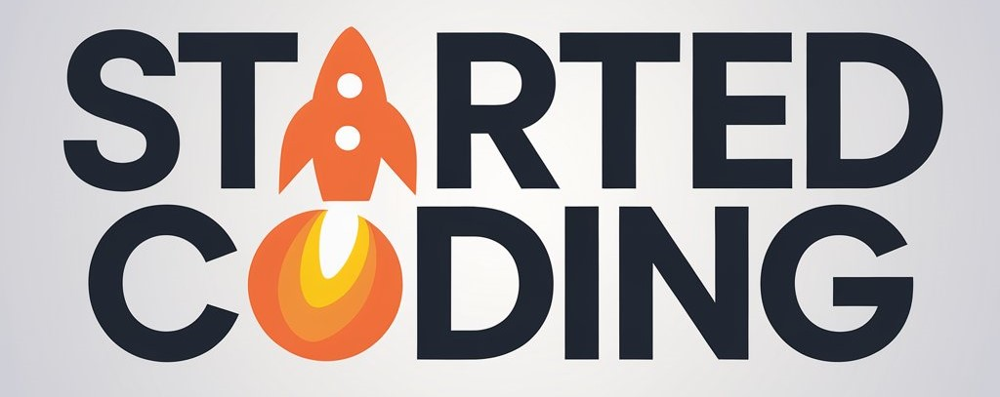

  

<h1 align="center">StartedCoding</h1>

  <em>Where curiosity meets creation — beyond just code.</em>

  <a href="https://startedcoding.com"><strong>🌐 Website</strong></a> •
  <a href="https://github.com/StartedCoding"><strong>🚀 Projects</strong></a> •
  <a href="https://github.com/StartedCoding-org"><strong>🧠 Learn More</strong></a>

---

## 💡 C.O.D.I.N.G. — The Journey of a Creator

> Every idea begins with curiosity — every creation begins with courage.

| Letter | Meaning | Description |
|:-------:|:---------|:------------|
| **C** | **Curiosity** | The spark that starts everything — “Why?” “How?” “What if?” |
| **O** | **Observation** | Notice the world deeply. Patterns, systems, people — understanding before acting. |
| **D** | **Design / Discovery** | Shape your ideas thoughtfully — blend creativity and logic to make things that matter. |
| **I** | **Implementation** | Act. Create. Express. Whether through code, art, or ideas — make it real. |
| **N** | **Nurture** | Improve, reflect, and refine. Growth comes from care and iteration. |
| **G** | **Growth** | Learn, evolve, and expand your perspective — not just as a creator, but as a human. |

---

## 🧭 What We Do

- 🧠 **Explore** — ideas, systems, stories, and skills that shape creators  
- 🎨 **Create** — projects, visuals, and experiences that inspire learning  
- 🚀 **Inspire** — a new way of thinking: curious, mindful, and creative  

---

## 🛠️ What We Use

  

---

## ❤️ Our Philosophy

> “We didn’t start coding just to build software —  
> we started to build ourselves.”

StartedCoding is more than a tech community.  
It’s a space for explorers, builders, artists, and thinkers who believe in **learning by creating** — in any form.  

If you love to learn, build, and grow — welcome home. ✨

---

  Made with ❤️ by the <a href="https://github.com/StartedCoding">StartedCoding</a> Community

